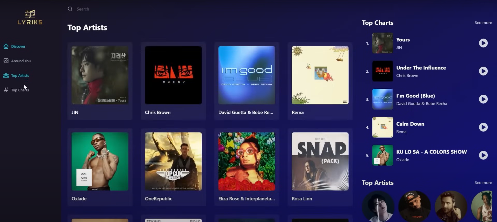
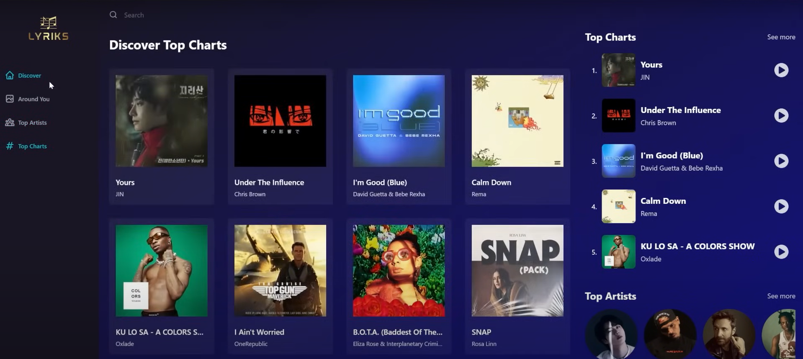
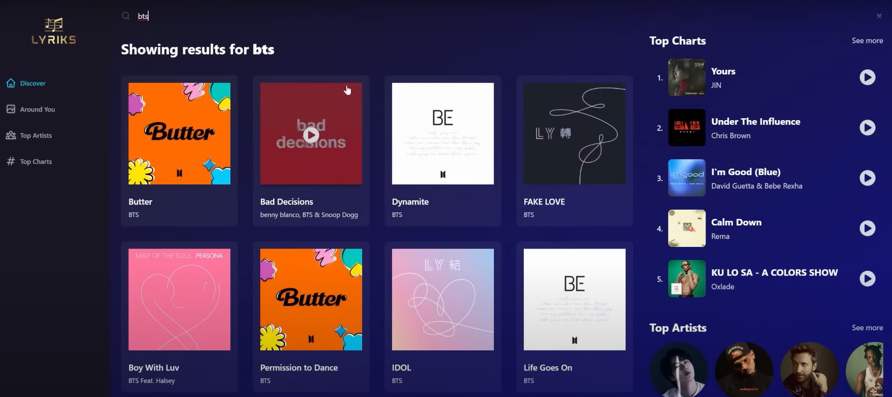

# 🎵 LYRİKS - Spotify Music Clone

A full-featured music streaming web application built using **React**, **Redux Toolkit**, and **RapidAPI**, designed to emulate a rich music experience similar to Spotify. This clone enables users to explore top charts, search for songs or artists, listen to track previews, and enjoy curated lists based on genres and countries — all within a modern, sleek interface.

## 📸 Project Screenshots

### 🏠 Discover Page

This is the homepage of the application. It features the currently trending music, a dropdown to choose genres, and highlights the top charts and artists in a compact sidebar.


---

### 👑 Top Artists Page

A beautiful scrollable view showcasing today's most popular artists. Users can click on any artist to explore more about their songs and background.



---

### 📊 Top Charts Page

Displays a list of globally trending songs. Users can play a preview of the tracks directly and check out the artist details.



---

### 🔍 Search Results Page

Enables users to search for any song, artist, or album. The application dynamically fetches and displays results from the Shazam Core API in real-time.



---

## 🚀 Features

* ✅ Modern UI/UX design
* ✅ Global top charts and genre-based music exploration
* ✅ Play and pause track previews
* ✅ Artist and track detail pages
* ✅ Search functionality for songs and artists
* ✅ Seamless page routing using React Router
* ✅ State management via Redux Toolkit
* ✅ RapidAPI integration for real-time data

---

## 🔧 Tech Stack

* **React.js** – Frontend Framework
* **Redux Toolkit** – State Management
* **Tailwind CSS** – Styling
* **RapidAPI (Shazam Core)** – API for music data
* **Vite** – Build tool for faster development

---

## 📁 Project Structure

```
src/
├── assets/              # Images and static files
├── components/          # Reusable UI components
├── pages/               # Pages like Discover, Top Charts, etc.
├── redux/               # Redux store and API slices
│   └── services/
│       └── shazamCore.js   # RapidAPI integration
├── App.jsx              # Main application component
├── main.jsx             # Entry point
```

---

## 🧠 Learnings

Through this project, I gained hands-on experience with:

* Asynchronous data fetching using `createApi` and `fetchBaseQuery` from Redux Toolkit Query
* Organizing scalable React project structure
* Building dynamic user interfaces with Tailwind CSS
* Managing API authentication securely using `.env` variables
* Debugging network issues and interpreting API errors effectively
